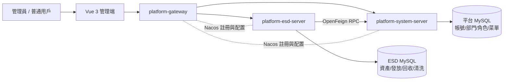
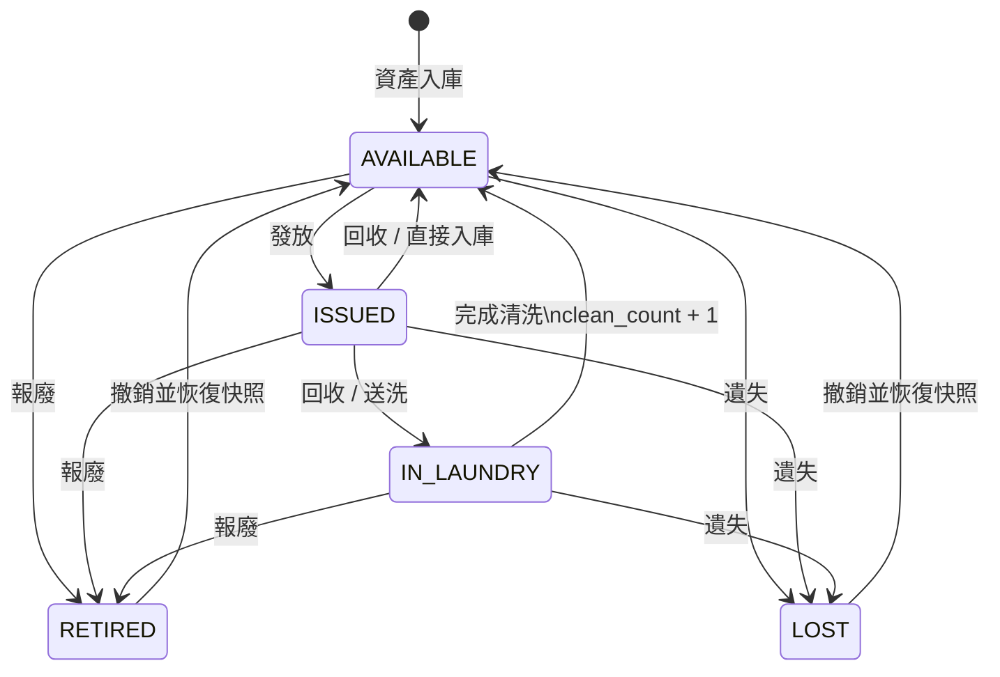
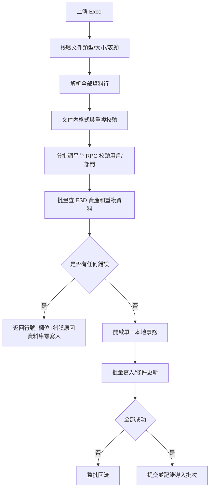

# 靜電衣鞋管理系統開發設計書

> 文件版本：v1.0  
> 文件日期：2026-08-11  
> 適用階段：架構評審、詳細設計、開發與測試  
> 需求基線：`静电衣鞋管理系统_需求文档.xlsx`、`静电衣鞋管理系统_详细需求规格说明书.md`、`問題補充.txt`  
> 現有平台：`platform-system-server-master`

## 1. 文件目的

本文將原始需求、詳細需求規格及最新補充說明收斂為可直接進入開發的技術方案，重點解決以下問題：

1. 明確統一管理平台與靜電衣鞋業務服務的系統邊界。
2. 確定 JDK 8、Spring Boot 2.7、Spring Cloud Alibaba 2021、MySQL 與 Vue 的落地技術棧。
3. 修正現有詳細需求中的帳號重建、資產狀態衝突、批量導入及備份恢復風險。
4. 定義資產狀態機、核心交易、資料模型、服務接口、權限及測試基線。

本文優先級低於後續經確認的變更單，高於舊需求文檔中與本文明確衝突的內容。

## 2. 已確認決策與需求修正

| 主題 | 最終設計決策 |
| --- | --- |
| 業務角色 | 僅 `ESD_ADMIN`（管理員）及 `ESD_USER`（普通用戶）兩種業務角色。平台自身可能存在技術管理帳號，但不作為靜電衣鞋業務角色展示或分配。 |
| 帳號與密碼 | 完全由 `platform-system-server` 管理；靜電衣鞋服務禁止保存密碼、密碼雜湊或自建登入接口。 |
| 員工工號 | 使用平台 `system_users.username` 作為工號；跨服務關聯使用平台 `userId`，工號和姓名只作快照及展示。 |
| 廠區與部門 | 廠區權限來自平台用戶 `site` 及登入權限信息 `sites`；部門來自平台 `system_dept`。樓層、班別等 ESD 專屬屬性保存在本服務。 |
| 業務服務 | 新建獨立微服務 `platform-esd-server`，不把 ESD 業務表或業務代碼放入 `platform-system-server`。 |
| 資產狀態 | 採用 `AVAILABLE`、`ISSUED`、`IN_LAUNDRY`、`RETIRED`、`LOST` 五個正式狀態。 |
| 清洗流程 | 第一階段只允許「已發放 -> 回收時選擇送洗 -> 清洗中 -> 完成清洗 -> 可用庫存」。清洗中資產不得再次回收。 |
| 一人多持 | 同一員工持有靜電衣大於 1 件，或靜電鞋大於 1 雙，任一條件成立即報警；衣與鞋不合併計數。 |
| 批量導入 | 全有或全無：任一行失敗，整批不寫入；返回完整行級錯誤清單。 |
| 併發發放 | 業務上不應發生，但後端仍以條件更新和事務保證同一資產只能成功發放一次，不依賴前端或人工約束。 |
| 備份恢復 | 必須做權限校驗、格式及版本校驗、校驗和校驗、外部引用校驗，且恢復前自動生成一次備份。 |
| Excel 處理 | 導入解析、校驗、導出均由後端完成；前端只負責上傳、下載及錯誤展示。 |

### 2.1 對舊詳細需求的明確覆蓋

以下內容不再按舊規格實施：

- 不建立舊稿中的 `users` 表，不保存 `password_hash` 或 `allowed_modules`。
- 不建立一套獨立的完整 `personnel` 帳號主檔；改為平台用戶加 `esd_person_profile` 擴展檔。
- 不允許 `IN_LAUNDRY` 資產再次進入回收流程。
- 第一階段不提供從「可用庫存」或「已發放」直接點擊送洗的旁路；送洗由回收交易產生。
- 不在瀏覽器使用 SheetJS 實施核心導入邏輯，避免繞過後端事務、權限和資料校驗。
- 報廢及遺失記錄的「刪除」改為「撤銷」，保留完整審計，不物理刪除歷史記錄。

## 3. 系統範圍與服務邊界

### 3.1 系統上下文



### 3.2 資料所有權

| 資料 | 唯一主責服務 | ESD 服務處理方式 |
| --- | --- | --- |
| 帳號、密碼、登入令牌 | `platform-system-server` | 僅使用登入身份，不保存密碼，不代理改密碼。 |
| 用戶狀態、工號、姓名 | `platform-system-server` | 以 `userId` 關聯；交易記錄保存工號、姓名快照以保證歷史可讀。 |
| 角色、菜單、按鈕權限 | `platform-system-server` | 在平台配置 ESD 菜單與權限碼，ESD Controller 使用 `@PreAuthorize`。 |
| 部門、部門負責人 | `platform-system-server` | 通過 `DeptApi` 查詢與校驗，不跨庫外鍵。 |
| 廠區及用戶廠區範圍 | `platform-system-server` | 從登入上下文取得允許廠區；所有 ESD 業務表均帶 `site_code`。 |
| 樓層、班別、ESD 啟用狀態 | `platform-esd-server` | 保存於 ESD 人員擴展檔。 |
| 資產及全生命週期 | `platform-esd-server` | 完整主責。 |
| 通用操作日誌 | `platform-system-server` | 經平台 `OperateLogApi` 集中記錄。 |
| 資產業務軌跡 | `platform-esd-server` | 保存不可刪除的 `esd_asset_event`，用於追溯和狀態復原。 |

### 3.3 不納入第一階段

- RFID、條碼槍或自動清洗設備的硬件協議整合。
- 獨立手機 App 或離線模式。
- 跨多個 ESD 微服務的分布式事務。
- 未給出規則的清洗壽命預警；在業務確認「最大清洗次數」前，只統計清洗次數，不自動判廢。
- ESD 模組內新增、刪除或重置平台帳號。此類操作統一在平台用戶管理完成。

## 4. 技術架構

### 4.1 後端技術棧

以 `platform-system-server-master` 現有 BOM 為準，不自行升降核心版本：

| 分類 | 選型 | 版本/約束 | 說明 |
| --- | --- | --- | --- |
| Java | OpenJDK / Oracle JDK | 8 | 編譯目標 `1.8`。 |
| Web 框架 | Spring Boot | `2.7.18` | 與平台一致。 |
| 微服務 | Spring Cloud | `2021.0.9` | 與平台一致。 |
| 微服務 Alibaba | Spring Cloud Alibaba | `2021.0.6.2` | Nacos 註冊及配置。 |
| ORM | MyBatis-Plus | `3.5.15` | 復用平台 starter、分頁、邏輯刪除及審計欄位。 |
| 資料庫 | MySQL | 建議 8.0 | 使用 InnoDB、`utf8mb4`；正式環境小版本由運維基線確定。 |
| 連接池 | Druid | `1.2.27` | 復用平台依賴。 |
| RPC | Spring Cloud OpenFeign | 平台 BOM | ESD 只調用平台公開 RPC API。 |
| Excel | FastExcel / 平台 `ExcelUtils` | `1.3.0` | 所有導入導出在服務端執行。 |
| 快取 | Redis | 平台配置 | 用於短期冪等鍵、恢復維護鎖；不作資產狀態真相來源。 |
| API 文件 | Springdoc + Knife4j | 平台 BOM | 產生 OpenAPI 文檔並由 Gateway 聚合。 |
| 測試 | JUnit 5、Mockito、Testcontainers 或專用 MySQL 測試庫 | JDK 8 相容版本 | 狀態機及事務必須在 MySQL 上做整合測試。 |

後端採用模組化單服務，不為每個功能拆微服務。發放、回收、清洗、報廢和遺失高度共享同一資產聚合及本地事務，拆分只會引入分布式一致性成本。

建議代碼結構：

```text
platform-esd/
├── platform-esd-api/                 # 對外 RPC 契約（目前可保持精簡）
└── platform-esd-server/
    └── src/main/java/com/foxconn/iad/module/esd/
        ├── controller/admin/         # 前端管理 API
        ├── service/                  # 交易編排與領域規則
        ├── dal/dataobject/           # esd_* 表映射
        ├── dal/mysql/                # Mapper
        ├── convert/                  # MapStruct 轉換
        ├── enums/                    # 穩定枚舉及錯誤碼
        ├── framework/datapermission/ # 廠區資料權限註冊
        └── job/                      # 人員快照校準、報警重算
```

### 4.2 前端技術棧

| 分類 | 選型 | 說明 |
| --- | --- | --- |
| 核心 | Vue 3 + TypeScript | 使用 Composition API 及 `<script setup>`。 |
| 工程 | Vite | 快速開發、按路由拆包。 |
| UI | Element Plus | 適合密集表格、表單、彈窗和後台工作流。 |
| 狀態 | Pinia | 僅保存登入信息、廠區上下文及必要字典，不複製服務端業務狀態。 |
| 路由 | Vue Router | 根據平台返回菜單動態註冊路由，路由守衛只作體驗層防護。 |
| HTTP | Axios | 統一令牌、錯誤碼、刷新令牌、文件上下載及取消重複請求。 |
| 圖表 | ECharts | Dashboard 及報表圖表。 |
| 日期 | Day.js | 統一日期格式與時區展示。 |
| 單元測試 | Vitest | 狀態、工具函數及組件測試。 |
| E2E | Playwright | 核心發放、回收、清洗、恢復流程。 |

前面提到的 FAT 前端實際為 Angular 11、ng-alain 11、ng-zorro-antd，並不是 Vue 工程，因此不能直接作為本系統 Vue 代碼底座。可以復用其統一登入流程、接口約定、企業視覺規範及業務交互經驗，但不複製 Angular 組件、路由或舊版依賴。

### 4.3 微服務部署拓撲

- 服務名：`platform-esd-server`。
- 建議端口：本地 `48082`，正式環境由部署平台分配。
- Gateway 新增管理端路由：`/admin-api/esd/** -> grayLb://platform-esd-server`。
- RPC 路徑保留：`/rpc-api/esd/**`，禁止由外部網絡直接訪問。
- 配置 DataId：`platform-esd-server-${spring.profiles.active}.yaml`，公共 Redis 等配置沿用平台 Nacos 配置。
- ESD 使用獨立 schema/帳號，例如 `platform_esd`；禁止直接查詢 `system_users` 或 `system_dept` 表。

## 5. 現有平台能力評估

### 5.1 可直接復用的能力

| 能力 | 現有實現 | 結論 |
| --- | --- | --- |
| 帳號密碼登入 | `AuthController`：`/system/auth/login`、`logout`、`refresh-token` | 直接復用，前端經 Gateway 訪問。 |
| 登入權限信息 | `/system/auth/get-permission-info` 返回用戶、角色、權限、菜單及 `sites` | 直接復用，作為前端菜單和廠區上下文來源。 |
| 用戶管理 | `UserController` 提供增刪改查、重置密碼、狀態、導入導出 | 仍由平台管理，不在 ESD 重做。 |
| 用戶主檔 | `AdminUserDO` 已有 `username`、BCrypt `password`、`deptId`、`site`、狀態等 | 能滿足帳號、工號、廠區及部門主資料需求。 |
| 用戶 RPC | `AdminUserApi` 支持按 ID、部門、崗位查詢及有效性校驗 | 可復用，但不足以支持工號導入和廠區過濾。 |
| 部門 RPC | `DeptApi` 支持單個、批量、子部門查詢和有效性校驗 | 直接復用。 |
| 角色/權限 | `RoleApi`、`PermissionApi` 及平台菜單角色管理 | 直接復用。 |
| 廠區選項 | `/system/dict-data/list-site-options`，登入信息返回可用 `sites` | 前端可復用。 |
| 廠區資料權限框架 | `SiteDataPermissionRule` + `SiteDataPermissionRuleCustomizer` | ESD 必須註冊每張帶 `site_code` 的表後復用。 |
| 操作日誌 | `OperateLogApi` 支持建立及按模組/業務資料分頁查詢 | 直接復用，另保留 ESD 資產事件帳。 |

### 5.2 必須補充的平台 RPC

現有 `AdminUserApi` 的 `AdminUserRespDTO` 不包含 `username` 和 `site`，也沒有按工號查詢或批量工號校驗接口，無法可靠支持 ESD 人員綁定及 Excel 導入。應在 `platform-module-system-api` 和其實現中做以下通用擴展：

| 新增/調整 | 建議契約 | 用途 |
| --- | --- | --- |
| 擴展 DTO | `AdminUserRespDTO` 增加 `username`、`site`、`email` | 返回工號和廠區範圍。禁止增加密碼。 |
| 按工號查詢 | `GET /rpc-api/system/user/get-by-username?username=` | 單筆人員綁定和交易校驗。 |
| 批量工號查詢 | `POST /rpc-api/system/user/list-by-usernames`，請求最多 500 個工號 | 導入預校驗，避免 N+1 RPC。 |
| 候選用戶分頁 | `POST /rpc-api/system/user/page`，條件含關鍵字、部門、廠區、狀態 | ESD 人員管理選擇平台已有用戶。 |

RPC 實現必須遵循以下規則：

- 只返回必要的非敏感欄位，絕不返回密碼、登入 IP 或令牌。
- 候選用戶分頁必須按調用者廠區範圍過濾，不得直接 `executeIgnore` 繞過資料權限。
- 批量工號查詢分批執行，單次最多 500 個，Excel 大批量由 ESD 端分塊調用。
- Feign 失敗時，新增/發放/導入等寫交易快速失敗，不允許用陳舊資料繼續寫入。

### 5.3 安全整改前置項

平台現有配置及認證代碼中存在硬編碼連接信息或密鑰的情況。正式上線前必須將密碼、Nacos 憑證、加密密鑰等移到環境變量或受控配置中心，完成密鑰輪換，並確認日誌不輸出令牌、密碼和恢復文件內容。此項不改變 ESD 功能範圍，但屬於上線阻斷項。

## 6. 領域模型與資產狀態機

### 6.1 正式狀態枚舉

| 數值 | Java/接口枚舉 | 中文正式名稱 | 英文含義 | 說明 |
| ---: | --- | --- | --- | --- |
| 10 | `AVAILABLE` | 可用庫存 | Available | 已入庫，可發放。 |
| 20 | `ISSUED` | 已發放 | Issued | 已交付員工使用，必須有當前持有人。 |
| 30 | `IN_LAUNDRY` | 清洗中 | In Laundry | 已回收並送洗，不存在當前持有人。 |
| 40 | `RETIRED` | 已報廢 | Retired | 已退出使用，終止狀態。`RETIRED` 比 `SCRAPPED` 更符合資產生命週期命名。 |
| 50 | `LOST` | 已遺失 | Lost | 已確認遺失，終止狀態。 |

Java 類名建議為 `EsdAssetLifecycleStatusEnum`。資料庫保存數值碼，不保存中英文顯示文本；前端顯示文本由後端枚舉或字典統一提供。

其他核心枚舉：

| 枚舉 | 值 |
| --- | --- |
| `EsdAssetTypeEnum` | `GARMENT`（靜電衣）、`SHOES`（靜電鞋） |
| `ReturnConditionEnum` | `NORMAL`（正常）、`DAMAGED`（損壞）、`SOILED`（髒污） |
| `ReturnDispositionEnum` | `RESTOCK`（直接入庫）、`LAUNDER`（送洗） |
| `BusinessRecordStatusEnum` | `ACTIVE`、`COMPLETED`、`TERMINATED`、`REVERSED` |
| `AlertTypeEnum` | `MULTIPLE_GARMENTS`、`MULTIPLE_SHOES` |
| `AlertStatusEnum` | `ACTIVE`、`RESOLVED` |

### 6.2 正常流轉



圖中撤銷的實際目標不是固定 `AVAILABLE`，而是交易快照中的 `previous_status`；可能恢復為 `AVAILABLE`、`ISSUED` 或 `IN_LAUNDRY`。

### 6.3 狀態不變式

1. `AVAILABLE`：`current_holder_user_id` 必須為空，不能有進行中的發放或清洗記錄。
2. `ISSUED`：`current_holder_user_id` 必須有值，且恰好存在一筆 `ACTIVE` 發放記錄。
3. `IN_LAUNDRY`：持有人必須為空，恰好存在一筆 `ACTIVE` 清洗記錄；不得再次回收或送洗。
4. `RETIRED`、`LOST`：持有人必須為空，不得發放、回收或完成清洗。
5. 任一資產在任一時刻最多有一筆進行中的發放記錄、回收交易和清洗記錄。
6. 清洗完成時狀態直接改為 `AVAILABLE`，同一事務內 `clean_count + 1` 並完成清洗記錄。
7. 撤銷只允許針對該資產最後一筆未撤銷的報廢/遺失交易，且資產版本與終止交易記錄一致。

### 6.4 報廢與遺失撤銷

報廢或遺失前保存以下快照：

- `previous_status`
- `previous_holder_user_id`
- `previous_active_issue_id`
- `previous_active_laundry_id`
- `previous_clean_count`
- `asset_version_before`

撤銷時在單一 MySQL 事務中鎖定資產，檢查當前狀態、終止記錄及版本，按快照恢復資產及被終止的發放/清洗記錄，將報廢/遺失記錄標記為 `REVERSED`，並新增一筆資產事件。歷史記錄不可物理刪除。

## 7. 核心業務流程

### 7.1 發放

1. 校驗操作人具有 `esd:issue:create` 及目標廠區權限。
2. 通過平台 API 校驗領用員工存在、啟用且屬於目標廠區；校驗 ESD 人員檔啟用。
3. 以條件更新將資產由 `AVAILABLE` 改為 `ISSUED` 並寫入持有人。
4. 新增發放記錄和資產事件。
5. 按員工和資產類型重算一人多持報警。
6. 事務提交後返回最新資產版本。

發放人由登入上下文取得，不接受前端自由填寫；前端只能展示。業務日期可輸入，操作時間由服務端產生。

### 7.2 回收與送洗

回收入口只接受 `ISSUED` 資產：

- `RESTOCK`：資產改為 `AVAILABLE`，清空持有人，完成發放記錄並新增回收記錄。
- `LAUNDER`：資產改為 `IN_LAUNDRY`，清空持有人，完成發放記錄，同時新增回收記錄和 `ACTIVE` 清洗記錄。

上述寫入均在同一事務內完成。交易完成後重算原持有人的衣、鞋持有數及報警。

### 7.3 完成清洗

1. 僅接受 `IN_LAUNDRY` 且存在 `ACTIVE` 清洗記錄的資產。
2. 資產狀態改為 `AVAILABLE`，`clean_count = clean_count + 1`。
3. 清空持有人，清洗記錄改為 `COMPLETED` 並記錄完成時間和操作人。
4. 新增資產事件；不得回到清洗前持有人或 `ISSUED` 狀態。

### 7.4 一人多持報警

每次可能改變持有關係的交易完成前，在同一事務中按 `holder_user_id + asset_type + status=ISSUED` 計數：

- 靜電衣數量 `> 1`：激活 `MULTIPLE_GARMENTS`。
- 靜電鞋數量 `> 1`：激活 `MULTIPLE_SHOES`。
- 數量恢復至 `<= 1`：將對應報警標記為 `RESOLVED`，前台報警中心默認不再顯示。

同一員工可能同時存在兩種報警。報警記錄不物理刪除，Dashboard 僅統計 `ACTIVE`。

為處理歷史導入或人工資料修復，提供每日全量重算 Job 和管理員手動重算接口；交易內重算仍是主要機制。

## 8. 權限與資料範圍

### 8.1 業務角色

| 功能 | `ESD_ADMIN` | `ESD_USER` |
| --- | --- | --- |
| Dashboard、報警、庫存查詢 | 允許 | 允許 |
| 人員擴展檔查詢 | 允許 | 允許 |
| 人員擴展檔綁定、導入、修改 | 允許 | 禁止 |
| 資產入庫、編輯、導入 | 允許 | 按權限配置，默認禁止 |
| 發放、回收、完成清洗 | 允許 | 允許 |
| 報廢、遺失及撤銷 | 允許 | 僅查看 |
| 報表及導出 | 允許 | 默認只查詢，導出需單獨授權 |
| 備份、恢復、清空 | 允許，且需高危操作確認 | 禁止 |
| 平台帳號、角色、菜單管理 | 需另有平台系統權限 | 不屬於 ESD 角色能力 |

角色只是預設權限集合，服務端最終按權限碼判斷，不使用 `if (role == ADMIN)` 硬編碼。

### 8.2 建議權限碼

```text
esd:dashboard:query
esd:alert:query
esd:person:query      esd:person:create      esd:person:update
esd:person:import     esd:person:export
esd:asset:query       esd:asset:create       esd:asset:update
esd:asset:delete      esd:asset:import       esd:asset:export
esd:issue:query       esd:issue:create       esd:issue:import       esd:issue:export
esd:return:query      esd:return:create      esd:return:import      esd:return:export
esd:laundry:query     esd:laundry:complete   esd:laundry:export
esd:scrap:query       esd:scrap:create       esd:scrap:reverse      esd:scrap:export
esd:loss:query        esd:loss:create         esd:loss:reverse       esd:loss:export
esd:inventory:query   esd:inventory:export
esd:report:query      esd:report:export
esd:settings:backup   esd:settings:restore    esd:settings:clear
```

### 8.3 廠區資料權限

所有業務主表及交易表使用統一欄位 `site_code`。ESD 服務新增 `EsdSitePermissionConfiguration`，通過 `SiteDataPermissionRuleCustomizer` 將全部 `esd_*` 業務表註冊到 `site_code`。

強制規則：

- 查詢由 MyBatis 資料權限插件追加 `site_code IN (...)`。
- 新增及狀態交易還需在 Service 層驗證請求 `siteCode` 屬於登入用戶 `sites`，防止只保護查詢、不保護寫入。
- 不信任前端傳入的廠區列表。
- 匯出和 Dashboard 統計同樣受廠區權限約束。
- 後台 Job 必須顯式按廠區執行，不能依賴無登入上下文的資料權限攔截器。

## 9. 資料庫設計

### 9.1 通用規範

- 表名前綴：`esd_`。
- 主鍵：`BIGINT`，沿用平台 ID 生成策略。
- 字符集：`utf8mb4`；時間使用 `DATETIME`，應用統一按 `Asia/Shanghai` 處理。
- 核心枚舉保存 `TINYINT/SMALLINT` 數值碼。
- 主檔使用平台通用審計欄位：`creator`、`create_time`、`updater`、`update_time`、`deleted`。
- 核心資產增加 `version INT NOT NULL DEFAULT 0`，用於條件更新及撤銷校驗。
- 跨服務的 `platform_user_id`、`dept_id` 不建立資料庫外鍵。
- 交易記錄保存工號、姓名、部門名稱等快照，避免平台主檔變更後歷史報表失真。

### 9.2 核心資料表

#### 9.2.1 `esd_person_profile` 人員擴展檔

| 欄位 | 類型 | 約束/說明 |
| --- | --- | --- |
| `id` | BIGINT | 主鍵 |
| `site_code` | VARCHAR(32) | 廠區，必填 |
| `platform_user_id` | BIGINT | 平台用戶 ID，必填 |
| `employee_no` | VARCHAR(64) | `system_users.username` 快照 |
| `employee_name` | VARCHAR(100) | 暱稱/姓名快照 |
| `dept_id` / `dept_name` | BIGINT / VARCHAR(100) | 部門 ID 及快照 |
| `supervisor_user_id` / `supervisor_name` | BIGINT / VARCHAR(100) | 責任主管 |
| `floor_code` | VARCHAR(32) | 樓層代碼 |
| `shift_code` | VARCHAR(32) | 班別代碼 |
| `esd_status` | TINYINT | `ENABLED/DISABLED`，不替代平台帳號狀態 |
| 通用欄位 | - | 審計、邏輯刪除 |

唯一索引：`uk_person_site_user(site_code, platform_user_id, deleted)`；普通索引：工號、部門、主管、班別。

同一平台用戶如確實跨廠區工作，可在不同 `site_code` 下建立擴展檔。交易時必須明確選定廠區。

#### 9.2.2 `esd_asset` 資產主檔

| 欄位 | 類型 | 約束/說明 |
| --- | --- | --- |
| `id` | BIGINT | 主鍵 |
| `asset_code` | VARCHAR(64) | 全局唯一物品編碼 |
| `site_code` | VARCHAR(32) | 所屬廠區 |
| `asset_type` | TINYINT | `GARMENT/SHOES` |
| `color_code` | VARCHAR(32) | 顏色字典碼 |
| `size_code` | VARCHAR(32) | 尺碼字典碼 |
| `lifecycle_status` | TINYINT | 五態枚舉 |
| `current_holder_user_id` | BIGINT NULL | 僅 `ISSUED` 有值 |
| `current_holder_no/name` | VARCHAR | 當前持有人快照 |
| `clean_count` | INT | 非負，默認 0 |
| `version` | INT | 樂觀版本 |
| 通用欄位 | - | 審計、邏輯刪除 |

索引：`uk_asset_code(asset_code)`、`idx_asset_site_status(site_code, lifecycle_status)`、`idx_asset_holder(site_code, current_holder_user_id, asset_type, lifecycle_status)`。

#### 9.2.3 交易與追溯表

| 表 | 用途 | 關鍵欄位 |
| --- | --- | --- |
| `esd_issue_record` | 發放與歸還結算 | asset/user 快照、issue_date、operator、status、close_time |
| `esd_return_record` | 每次回收交易 | active_issue_id、condition、disposition、returner/receiver 快照、return_date |
| `esd_laundry_record` | 清洗中的工作及清洗歷史 | return_record_id、send_time、complete_time、status、operators |
| `esd_scrap_record` | 報廢與撤銷 | reason、previous_* 快照、status、reverse_operator/time |
| `esd_loss_record` | 遺失與撤銷 | responsible user、handle_method、previous_* 快照、status |
| `esd_alert` | 當前及歷史報警 | user/type、hold_count、status、first/last_trigger_time、resolved_time |
| `esd_asset_event` | 不可刪除的資產業務事件帳 | asset_id、event_type、before/after_status、operator、business_record_id、payload_json |
| `esd_import_batch` | 導入批次審計 | module、file_name/hash、total_rows、status、error_count、operator |
| `esd_backup_record` | 備份/恢復審計及文件元資料 | operation_type、schema_version、checksum、storage_key、status |

所有交易表都包含 `site_code`、`asset_id`、`asset_code` 快照及通用審計欄位。資產事件、已完成交易及備份審計禁止由普通 CRUD 接口刪除。

### 9.3 資料一致性約束

- 發放使用條件更新，而不是先查詢再無條件更新。
- 資產代碼全局唯一；導入先校驗文件內重複，再校驗資料庫重複。
- 發放、清洗等進行中記錄由服務層和資產狀態雙重約束；如 MySQL 版本允許，可增加 generated column 唯一索引保證每個資產只有一筆活動記錄。
- `clean_count` 只能由完成清洗交易遞增；一般資產編輯接口不可修改。
- 交易日期不能晚於當前業務日期；是否允許補登歷史日期由管理權限控制。
- 刪除人員擴展檔前，必須確認不存在 `ISSUED` 資產；清洗中已無持有人，但歷史引用仍保留。

## 10. API 設計

### 10.1 公共約定

- 外部前綴：`/admin-api/esd`；Controller 內部根路徑：`/esd`。
- 使用平台 `CommonResult<T>`、`PageResult<T>`、錯誤碼和校驗框架。
- `POST` 建立、`PUT` 更新/狀態操作、`DELETE` 僅用於可安全刪除的主檔；撤銷使用明確的 `PUT /reverse`。
- 所有寫接口支持 `requestId` 冪等鍵；至少對發放、回收、完成清洗、恢復提供服務端去重。
- 列表默認每頁 20，最大每頁 200；導出走異步或流式響應，不以超大 pageSize 模擬導出。
- 日期請求使用 `yyyy-MM-dd`，時間響應使用 `yyyy-MM-dd HH:mm:ss`。

### 10.2 主要接口清單

| 模組 | 方法與路徑 | 說明 |
| --- | --- | --- |
| Dashboard | `GET /esd/dashboard/summary` | 可用、已發放、清洗中、活動報警統計 |
| Dashboard | `GET /esd/dashboard/distribution` | 類型/顏色/尺碼分布 |
| 報警 | `GET /esd/alerts/page` | 默認查 `ACTIVE`，可查歷史 |
| 人員 | `GET /esd/person-profiles/page` | ESD 人員擴展檔 |
| 人員 | `GET /esd/person-profiles/candidates` | 經後端調平台 RPC 查候選用戶 |
| 人員 | `POST /esd/person-profiles`、`PUT /{id}` | 綁定及修改 ESD 屬性 |
| 人員 | `POST /esd/person-profiles/import` | 原子導入 |
| 資產 | `GET /esd/assets/page`、`GET /esd/assets/{id}` | 列表及全生命週期詳情 |
| 資產 | `POST /esd/assets`、`PUT /esd/assets/{id}` | 入庫及允許欄位編輯 |
| 資產 | `POST /esd/assets/import` | 原子導入 |
| 發放 | `POST /esd/issues` | 單筆發放 |
| 發放 | `POST /esd/issues/import` | 批量原子發放 |
| 回收 | `POST /esd/returns` | 直接入庫或送洗 |
| 回收 | `POST /esd/returns/import` | 批量原子回收 |
| 清洗 | `GET /esd/laundries/active-page` | 清洗中列表 |
| 清洗 | `PUT /esd/laundries/{id}/complete` | 完成後直接入庫 |
| 報廢 | `POST /esd/scraps`、`PUT /esd/scraps/{id}/reverse` | 報廢及撤銷 |
| 遺失 | `POST /esd/losses`、`PUT /esd/losses/{id}/reverse` | 遺失及撤銷 |
| 庫存 | `GET /esd/inventory/summary`、`GET /esd/inventory/page` | 分組統計及明細 |
| 報表 | `GET /esd/reports/{reportType}/page` | 六類報表共用模式 |
| 導出 | `POST /esd/exports`、`GET /esd/exports/{taskId}` | 大資料量採任務化；小資料可直接下載 |
| 備份 | `POST /esd/settings/backups` | 建立 ESD 備份 |
| 恢復 | `POST /esd/settings/restores/validate` | 僅解析和校驗，不寫資料 |
| 恢復 | `POST /esd/settings/restores/{token}/execute` | 使用短效校驗令牌執行恢復 |
| 清空 | `POST /esd/settings/clear/validate`、`execute` | 與恢復相同的兩階段高危操作 |

### 10.3 典型發放請求

```json
{
  "requestId": "4a0c9d10-61ca-4cc0-884a-242c9b9cfa74",
  "siteCode": "ZZ",
  "employeeUserId": 1024,
  "assetId": 88001,
  "issueDate": "2026-08-11",
  "remark": ""
}
```

前端不得提交可冒充的 `issuerUserId`；服務端從登入上下文寫入操作人。

### 10.4 業務錯誤碼示例

| 錯誤碼 | 含義 |
| --- | --- |
| `ESD_ASSET_NOT_FOUND` | 資產不存在或不在可見廠區 |
| `ESD_ASSET_STATUS_CONFLICT` | 資產狀態已改變，操作不可執行 |
| `ESD_ASSET_ALREADY_ISSUED` | 資產已被他人或其他請求發放 |
| `ESD_PERSON_DISABLED` | 平台帳號或 ESD 人員檔已停用 |
| `ESD_SITE_FORBIDDEN` | 無目標廠區資料權限 |
| `ESD_LAUNDRY_ALREADY_COMPLETED` | 清洗記錄已完成 |
| `ESD_IMPORT_VALIDATION_FAILED` | 導入有錯，整批未寫入 |
| `ESD_RESTORE_VERSION_INCOMPATIBLE` | 備份 schema 版本不相容 |
| `ESD_RESTORE_CHECKSUM_INVALID` | 備份文件校驗和不一致 |
| `ESD_RESTORE_MAINTENANCE_LOCKED` | 系統正在恢復或清空，暫停寫操作 |

## 11. 事務、併發與冪等設計

### 11.1 同一資產併發發放

即使正常流程不應有多人同時操作，網絡重試、雙擊、批量任務和多終端仍可能產生競爭。設計不使用長時間悲觀鎖，而以單條條件更新完成原子搶佔：

```sql
UPDATE esd_asset
SET lifecycle_status = 20,
    current_holder_user_id = ?,
    current_holder_no = ?,
    current_holder_name = ?,
    version = version + 1,
    updater = ?,
    update_time = NOW()
WHERE id = ?
  AND site_code = ?
  AND lifecycle_status = 10
  AND version = ?
  AND deleted = 0;
```

影響行數為 1 才能繼續新增發放記錄；影響行數為 0 返回狀態衝突。資產更新、發放記錄、事件及報警更新放在同一個本地 `@Transactional` 事務中。因此不需要引入 Seata 或顯式 `SELECT ... FOR UPDATE` 來處理普通發放。

### 11.2 冪等

- 寫請求攜帶客戶端 UUID `requestId`。
- Redis 使用短期 `SET NX` 避免雙擊，資料庫交易記錄保留唯一 `request_id` 作最終防線。
- 相同 `requestId` 和相同請求返回原結果；相同 `requestId` 但參數不同返回衝突。
- 不把 Redis 鎖當作資產一致性的唯一保證，最終仍依賴 MySQL 條件更新和唯一約束。

### 11.3 RPC 與本地事務邊界

平台用戶及部門校驗在開啟 ESD 資料庫事務前完成，避免持有資料庫鎖時等待遠程服務。平台 RPC 只讀，因此不需要分布式事務。RPC 成功後如果用戶狀態立即變化，屬於可接受的極短一致性窗口；交易仍保存當時快照和操作證據。

## 12. 批量導入與導出

### 12.1 原子導入流程



實施規則：

- 第一階段單文件上限建議 5,000 行、16 MB；超出時提示拆分，不在一個超長事務中處理。
- 校驗需一次返回盡可能完整的行級錯誤，不讓使用者逐次修一個錯誤。
- 遠程校驗和大部分讀校驗在事務外完成；最終寫入事務內再次執行唯一性和狀態條件檢查。
- 任一寫入失敗拋出異常並整批回滾。
- 模板包含版本號、必填標記、枚舉可選值及示例，但不在模板中放真實個人資料。
- 錯誤結果可下載 Excel，欄位至少包含原行號、字段名、原值和錯誤原因。

### 12.2 導出

- 導出條件與列表查詢條件共用 Query DTO 和資料權限。
- 少量資料直接流式輸出；超過 20,000 行建議建立異步導出任務。
- Excel 公式注入防護：以 `= + - @` 開頭的自由文本在寫出時轉義。
- 工號、姓名等個資僅提供給有對應查詢/導出權限的人員。

## 13. 備份、恢復與清空

### 13.1 備份範圍

備份只包含 ESD 自有資料，不包含平台帳號、密碼、部門、角色、菜單和令牌。平台引用以 `platform_user_id`、`dept_id` 及交易快照保存。

備份包建議為 ZIP，內含 JSON 文件及清單：

```text
esd-backup-20260811T143000+0800.zip
├── manifest.json
├── person_profiles.json
├── assets.json
├── issue_records.json
├── return_records.json
├── laundry_records.json
├── scrap_records.json
├── loss_records.json
├── alerts.json
├── asset_events.json
└── import_batches.json
```

`manifest.json` 至少包含：

```json
{
  "format": "ESD_BACKUP",
  "schemaVersion": "1.0",
  "applicationVersion": "1.0.0",
  "exportedAt": "2026-08-11T14:30:00+08:00",
  "tenantId": 1,
  "siteCodes": ["ZZ"],
  "tableCounts": {"assets": 1000},
  "contentChecksumAlgorithm": "SHA-256",
  "contentChecksum": "..."
}
```

### 13.2 兩階段恢復

第一階段 `validate`：

1. 校驗 `esd:settings:restore` 權限、登入狀態及廠區範圍。
2. 校驗 ZIP 結構、文件大小、JSON schema、`schemaVersion`、校驗和及記錄數。
3. 阻止 ZIP Slip、壓縮炸彈、重複文件名和超大解壓內容。
4. 校驗資產狀態不變式、主鍵/資產碼重複及表間引用。
5. 分批調平台 RPC 校驗仍需啟用的用戶、部門和廠區引用。
6. 產生 10 分鐘有效的一次性 restore token 和影響摘要，不寫業務資料。

第二階段 `execute`：

1. 再次校驗權限並要求高危操作二次確認；建議要求重新輸入當前密碼或走統一認證二次驗證。
2. 取得全局維護鎖，Gateway/ESD 服務拒絕新的 ESD 寫請求。
3. 自動建立恢復前備份；備份失敗則終止恢復。
4. 再校驗一次 restore token、文件雜湊和目前資料版本。
5. 在單一資料庫事務中按依賴順序清理並恢復 ESD 表；任何錯誤整體回滾。
6. 提交後重建必要統計/快取，釋放維護鎖，記錄平台操作日誌和本地備份審計。

不支持將高版本 schema 直接恢復到低版本應用。舊版本升級必須有顯式 migration；未知版本一律拒絕。

### 13.3 一鍵清空

清空與恢復使用相同的權限、維護鎖、二次確認及恢復前自動備份機制。清空 ESD 業務資料不影響平台帳號、部門、角色和菜單。是否清空操作審計及備份索引由策略決定，默認保留，避免清除操作本身無法追溯。

## 14. 前端詳細設計

### 14.1 工程結構

```text
src/
├── api/
│   ├── system/auth.ts
│   └── esd/{dashboard,person,asset,issue,return,laundry,...}.ts
├── components/esd/
│   ├── AssetCodeSelect.vue
│   ├── EmployeeSelect.vue
│   ├── ImportDialog.vue
│   ├── StatusTag.vue
│   └── HighRiskConfirmDialog.vue
├── stores/{auth,permission,site,dictionary}.ts
├── router/
├── utils/{request,download,permission}.ts
└── views/esd/
    ├── dashboard/
    ├── alerts/
    ├── persons/
    ├── assets/
    ├── issues/
    ├── returns/
    ├── laundries/
    ├── scraps/
    ├── losses/
    ├── inventory/
    ├── reports/
    └── settings/
```

### 14.2 登入與權限流程

1. 前端調用 Gateway 的 `/admin-api/system/auth/login`。
2. 登入成功後調用 `/admin-api/system/auth/get-permission-info`。
3. Pinia 保存必要的用戶、`roles`、`permissions`、`menus`、`sites`；密碼不進入 Store 或日誌。
4. 根據平台菜單建立 ESD 動態路由，按權限碼控制按鈕顯示。
5. 所有真正的授權與資料範圍仍由後端執行；隱藏按鈕不能視為安全措施。

### 14.3 交互原則

- 掃碼/輸入資產代碼後直接回查資產最新狀態，狀態不符合時在提交前提示，提交時後端再次校驗。
- 發放、回收和完成清洗使用固定尺寸工作彈窗，提交中禁用按鈕，防止重複提交。
- 導入對話框分「下載模板、選擇文件、預檢結果、正式提交」狀態；原子失敗時清楚顯示「本次 0 行成功」。
- 報廢、遺失撤銷、恢復、清空均顯示影響對象，不使用含糊的「確定嗎」。
- 列表保留篩選條件和頁碼；從資產詳情返回時不重置操作上下文。
- 狀態顏色保持語義一致：可用為綠、已發放為藍、清洗中為橙、已報廢為灰、已遺失為紅；顏色之外同時顯示文字。

## 15. 報表與統計

六類報表保持需求範圍：發放、回收、清洗、報廢、遺失、員工持有明細。設計原則如下：

- 報表只查 ESD 本地交易和快照，不在 SQL 中跨庫連接平台表。
- 當前人員信息可在展示層批量補充，但歷史報表默認顯示交易發生時快照。
- Dashboard 統計使用索引聚合；第一階段不引入獨立 OLAP 或 Elasticsearch。
- 報表查詢必須帶廠區條件；時間範圍默認當月，單次查詢最大 1 年，超範圍走導出任務。
- 人員持有明細以當前 `esd_asset.lifecycle_status=ISSUED` 為準，不從發放歷史反推。

## 16. 安全與審計

- 認證、令牌驗證、權限註解、租戶及資料權限復用平台安全 starter。
- 密碼只存在平台帳號服務，使用現有 BCrypt；ESD DB、備份及日誌中均不得出現密碼。
- 所有導入文件、恢復文件限制類型、大小、解析深度和處理超時；不信任文件名和 MIME type。
- Controller DTO 使用 Bean Validation；SQL 僅通過 MyBatis 參數綁定。
- 操作日誌需覆蓋新增、修改、導入、導出、發放、回收、完成清洗、報廢、遺失、撤銷、備份、恢復和清空。
- 日誌對令牌、密碼、手機、郵箱及上傳文件內容脫敏；禁止記錄完整 Authorization Header。
- 資產事件記錄 before/after 狀態、業務記錄 ID、操作人、來源 IP/請求 ID；事件禁止業務端刪除。
- 備份文件存儲需限制下載權限及有效期；如平台具備密鑰管理，使用 AES-256-GCM 加密並對清單簽名。

## 17. 性能、可用性與可觀測性

### 17.1 初始性能目標

| 指標 | 目標 |
| --- | --- |
| 普通分頁/詳情 API | P95 < 500 ms（不含網絡） |
| 發放/回收/完成清洗 | P95 < 800 ms |
| Dashboard | P95 < 1 s |
| 5,000 行導入預檢 | 60 s 內完成，無逐行 RPC |
| 一致性 | 單資產不得出現雙重發放或雙重活動清洗記錄 |
| 可追溯 | 所有狀態改變均有業務事件及操作人 |

實際 SLA 需在取得資產量、員工量、日交易量和併發量後再校準。

### 17.2 可觀測性

- 使用平台 Actuator、統一日誌和鏈路標識 `traceId/requestId`。
- 監控指標包括：各交易成功/失敗數、狀態衝突數、平台 RPC 延遲、導入耗時、恢復結果、活動報警數。
- 對平台 RPC 不可用、恢復失敗、報警重算不一致設置告警。
- 健康檢查區分 MySQL、Redis、Nacos 和平台 RPC；平台 RPC 故障不應讓只讀歷史查詢全部下線，但必須阻止依賴人員有效性的寫交易。

## 18. 測試策略與關鍵用例

### 18.1 單元測試

- 五態狀態機所有允許和禁止的邊。
- 衣服大於 1、鞋子大於 1、衣鞋各 1 的報警判定。
- 報廢/遺失快照及撤銷校驗。
- 導入文件內重複、平台用戶失效、枚舉錯誤和行級錯誤聚合。
- 備份 manifest 版本、校驗和、引用完整性及惡意 ZIP 防護。

### 18.2 MySQL 整合測試

1. 兩個並發請求發放同一資產，必須只有一個成功。
2. 回收選送洗後，同一事務內完成發放、回收和清洗記錄並進入 `IN_LAUNDRY`。
3. 對清洗中資產再次回收，必須拒絕且資料不變。
4. 完成清洗後直接 `AVAILABLE`，清洗次數只增加一次；重試不重複增加。
5. 100 行導入第 99 行失敗時，資料庫新增/更新行數為 0。
6. 恢復任一步驟失敗時整體回滾，恢復前備份仍可用。
7. 無某廠區權限的用戶，列表、詳情、導出和按 ID 寫操作均無法越權。

### 18.3 E2E 驗收主線

- 平台登入 -> 載入菜單/廠區 -> 綁定人員 -> 資產入庫 -> 發放 -> 觸發一人多衣報警 -> 回收送洗 -> 報警自動解除 -> 完成清洗 -> 可用庫存。
- 管理員報廢/遺失 -> 查詢事件軌跡 -> 合法撤銷 -> 精確恢復前態。
- 備份 -> 修改資料 -> 校驗恢復 -> 自動備份 -> 恢復 -> 驗證記錄數和狀態。

## 19. 開發階段與交付順序

### 第一階段：平台整合與骨架

- 補充平台用戶 RPC 的工號、廠區和分頁能力。
- 建立 `platform-esd-server`、Gateway 路由、Nacos 配置、獨立 MySQL schema。
- 配置平台登入、菜單、兩個角色、權限碼及廠區資料權限。
- 建立 Vue 3 工程殼、統一請求、動態路由及基礎版面。

### 第二階段：核心閉環

- 人員擴展檔、資產、發放、回收送洗、完成清洗。
- 資產狀態機、條件更新、冪等、資產事件和一人多持報警。
- Dashboard、報警中心和庫存。

### 第三階段：管理與批量能力

- 報廢、遺失、撤銷。
- 全模組 Excel 模板、原子導入、導出及錯誤報告。
- 六類報表。

### 第四階段：高風險運維功能

- 版本化備份、兩階段恢復、恢復前自動備份及一鍵清空。
- 安全測試、併發測試、資料權限測試和恢復演練。

高風險恢復功能安排在核心資料模型穩定後開發，避免備份格式過早固化。

## 20. 上線前檢查清單

- [ ] 平台 RPC 擴展通過接口兼容性評審，未暴露密碼等敏感字段。
- [ ] ESD 兩個角色、菜單和所有按鈕權限已初始化。
- [ ] 每張 ESD 業務表已註冊 `site_code` 資料權限並通過越權測試。
- [ ] 發放、回收、清洗、報廢、遺失及撤銷已通過狀態機和併發測試。
- [ ] 全部導入均驗證「任一行失敗則整批零寫入」。
- [ ] 清洗中再次回收被前後端共同禁止，完成清洗直接入庫。
- [ ] 備份恢復完成版本、權限、校驗和、引用及恢復前自動備份測試。
- [ ] 配置文件與源碼中正式環境密鑰、密碼已外置和輪換。
- [ ] 操作日誌及資產事件可追溯，敏感信息已脫敏。
- [ ] MySQL 備份、監控、告警和故障回滾方案完成運維演練。

## 21. 待業務/運維確認但不阻塞骨架開發的事項

1. MySQL 正式環境的確切 8.0 小版本、HA 方式及備份保留週期。
2. 廠區、樓層、班別、顏色、尺碼採用的正式字典碼和維護責任人。
3. 靜電衣/鞋最大清洗次數及超限後是報警、禁止發放還是自動建議報廢。
4. 報廢及遺失是否允許直接作用於 `IN_LAUNDRY`；本文按原需求暫定允許並終止活動清洗記錄。
5. 普通用戶是否默認具有資產入庫和報表導出權限；本文按最小權限原則暫定不具有。
6. 備份文件的存儲位置、最大保留數、加密密鑰託管及下載有效期。
7. 單日交易量、資產總量、員工總量及預期併發，用於最終性能基線和容量估算。

以上事項應在對應模組開發前形成配置或變更單，不應再以散落的口頭規則寫入代碼。
