# 靜電衣鞋管理系統 (Anti-static Garment & Shoe Management System)
## 📋 深度需求規格說明書 (Software Requirements Specification / PRD)

> **文件版本**：v2.1.0 (含 Excel 原始界面示意圖 & ASCII 原型圖，並套用 12 項補充需求)  
> **編寫角色**：高級需求規劃師 (Lead Systems Analyst)  
> **目標對象**：全棧開發 Agent / GPT-5.6 Developer / 專案團隊  
> **更新日期**：2026-08-13  

> **v2.1.0 變更摘要**（對應《問題補充.txt》12 項補充需求）：
> 1. 首頁移除「最近報警」，資產狀態分佈與按類型統計可聯動。
> 2. 報警中心只呈現信息，無未處理/已處理狀態與標記操作，新增手動刷新按鈕（無定時刷新）。
> 3. 入庫時狀態為庫存、清洗次數為 0、工號/姓名/責任主管/課別/樓層為空；發放後從人員庫補入記錄。
> 4. 資產編碼唯一、每編碼一條記錄；多次發放只顯示最新；詳情發放/清洗歷史只顯示最近一次。
> 5. 發放管理一資產多次發放，全部記錄顯示。
> 6. 資產狀態改為 6 態：庫存、發放中、待送洗、清洗中、丟失、報廢。
> 7. 普通用戶僅首頁/報警/人員/資產的查看+導出，其餘頁面不顯示。
> 8. 批量導入一行失敗即整體回滾，提示全部失敗信息。
> 9. 移除報表中心、庫存管理；系統設置改為帳號設置（走平台統一後台）。
> 10. 人員管理不顯示靜電衣/鞋數量。
> 11. 清洗頁完成清洗後不再顯示（去掉清洗歷史頁籤）。
> 12. 回收登記去掉「回收狀態」。  

---

## 📑 目錄

1. [專案背景與業務效益分析](#一-專案背景與業務效益分析)
2. [系統總體架構與資產狀態流轉矩陣](#二-系統總體架構與資產狀態流轉矩陣)
3. [角色與權限體系 (RBAC)](#三-角色與權限體系-rbac)
4. [12 大功能模組詳細規格說明 (含原需求 UI 示意圖)](#四-12-大功能模組詳細規格說明-含原需求-ui-示意圖)
   - [M01. 項目概述與業務流程](#m01-項目概述與業務流程)
   - [M02. 登錄與鑑權模組](#m02-登錄與鑑權模組)
   - [M03. 首頁概覽 (Dashboard)](#m03-首頁概覽-dashboard)
   - [M04. 報警中心 (Alert Center)](#m04-報警中心-alert-center)
   - [M05. 人員管理 (Personnel)](#m05-人員管理-personnel)
   - [M06. 資產管理 (Assets)](#m06-資產管理-assets)
   - [M07. 發放管理 (Issue)](#m07-發放管理-issue)
   - [M08. 回收管理 (Return)](#m08-回收管理-return)
   - [M09. 清洗管理 (Laundry)](#m09-清洗管理-laundry)
   - [M10. 報廢管理 (Scrap)](#m10-報廢管理-scrap)
   - [M11. 丟失管理 (Lost)](#m11-丟失管理-lost)
   - [M12. 帳號設置 (Account Settings)](#m12-帳號設置-account-settings)
5. [資料庫 Schema 實體關係規範 (Database Blueprint)](#五-資料庫-schema-實體關係規範-database-blueprint)
6. [GPT-5.6 專用開發指引與 Prompt](#六-gpt-56-專用開發指引與-prompt)

---

## 一、 專案背景與業務效益分析

### 1.1 背景痛點 (Background & Pain Points)
依照 PVD 車間靜電衣管理規範，每半個月需對車間內人員的靜電衣鞋進行集中統一清洗。在系統導入前存在以下核心痛點：
* **a. 流程繁瑣**：送洗、發放、回收依賴紙質記錄或分散 Excel 表格，效率低下且易出錯。
* **b. 丟失與違規風險**：缺乏實時庫存監控，難以追蹤衣物去向，容易發生資產丟失或「一人持有多件」違規現象。
* **c. 靜電防護不規範**：無法自動校驗員工是否超量持有、靜電衣穿戴或清洗次數是否超過規範要求，存在靜電防護失效的質量隱患。
* **d. 流程不閉環**：清洗歷史、發放記錄與資產狀態未形成數據閉環，難以進行數據分析與追溯優化。

### 1.2 效益精算模型 (ROI & Labor Savings)
導入本系統後，每半個月車間統一回收發放清洗的工時節省計算如下：
* **1. 靜電衣回收登記**：
  * 線體By班別統一回收：由 2H/次 -> 0.5H/次（共 13 線體 x 2 班）
  * By樓層統一回收：由 8H/次 -> 4H/次（共 2 樓層 x 2 班）
  * 部門統一盤點收集：由 16H/次 -> 6H/次
  * **單次節省**：((13x2H/次x2班) + (2樓層x8H/次x2班) + 16H/次) - ((13x0.5H/次x2班) + (2樓層x4H/次x2班) + 6H/次) = 100H - 35H = 65H/次
* **2. 靜電衣發放登記**：效益同回收登記（單次節省 65H/次）。
* **月度總計節省工時**：(65H (回收) + 65H (發放)) x 2次/月 = 260小時/月。

---

## 二、 系統總體架構與資產狀態流轉矩陣

### 2.1 系統總體藍圖
系統包含前端視覺介面、業務邏輯層、實時檢測引擎與持久化資料庫，整體架構如下所示：

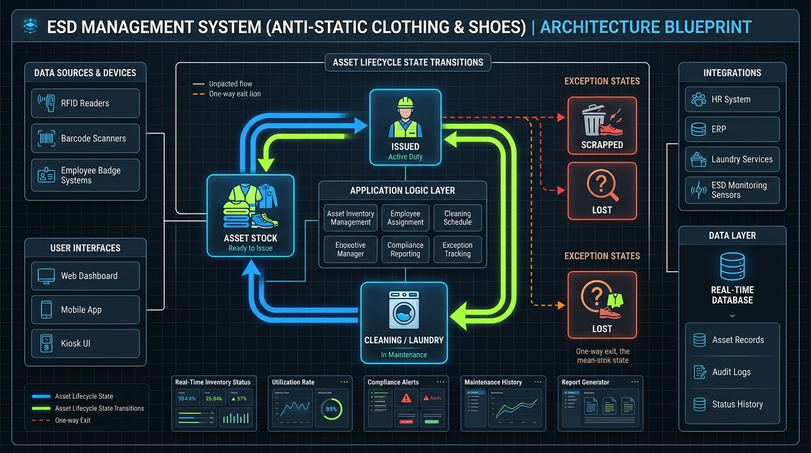

### 2.2 資產狀態機流轉矩陣 (Asset State Machine)

靜電衣鞋資產包含 **6 大核心狀態**：`庫存 (Stock)`、`發放中 (Issued)`、`待送洗 (Pending Laundry)`、`清洗中 (In Laundry)`、`報廢 (Scrapped)`、`丟失 (Lost)`。

| 初始狀態 | 觸發動作 / 模組 | 目標狀態 | 額外欄位變更 | 關聯業務影響 |
| :--- | :--- | :--- | :--- | :--- |
| **- (新入庫)** | 資產入庫 (A-01) | `庫存` | `employeeId=null`, `cleanCount=0`, 工號/姓名/責任主管/課別/樓層為空 | 寫入 `assets` 表 |
| `庫存` | 發放登記 (I-03) | `發放中` | `employeeId = 工號`，並從人員庫補入工號/姓名/責任主管/課別/樓層快照 | 寫入 `issue_records`，觸發一人多持報警檢查 |
| `發放中` | 回收登記 (R-03 - 入庫) | `庫存` | `employeeId = null` | 標記 `issue_records.returned=true`，觸發報警檢查 |
| `發放中` | 回收登記 (R-03 - 送洗) | `待送洗` | `employeeId = null` | 標記 `issue_records.returned=true`，觸發報警檢查 |
| `待送洗` | 送洗登記 (CL-04) | `清洗中` | 記錄 `oldStatus`, `previousEmployeeId` | 寫入 `laundry_records` |
| `清洗中` | 完成清洗 (CL-05) | `庫存` | `cleanCount += 1`, `employeeId=null` | 更新 `laundry_records.returnDate`，完成後從清洗頁移除 |
| 任意非報廢 | 報廢登記 (SC-02) | `報廢` | 暫存前置狀態/持有人/清洗次數 -> `employeeId=null` | 若原為`發放中`，標記 `issue_records.returned=true` |
| `報廢` | 撤銷報廢 (SC-04) | `復原前置狀態` | 恢復前置持有人、前置清洗次數 | 若前置為`發放中`，復原發放記錄未歸還狀態 |
| 任意非丟失 | 丟失登記 (LO-02) | `丟失` | 暫存前置狀態/持有人/清洗次數 -> `employeeId=null` | 寫入 `lost_records` |
| `丟失` | 撤銷丟失 (LO-04) | `復原前置狀態` | 恢復前置持有人、前置清洗次數 | 恢復發放記錄與歷史狀態 |

---

## 三、 角色與權限體系 (RBAC)

| 權限項目 | 管理員 (Administrator) | 普通用戶 (Standard User) |
| :--- | :---: | :---: |
| **帳號權限** | 系統唯一/頂級權限，可管理用戶帳號與菜單授權 | 由管理員創建，僅能訪問授權模組 |
| **首頁 / 報警中心 / 人員 / 資產** | 完全權限 (增刪改查/導入導出) | 僅查看 + 導出權限 |
| **發放 / 回收 / 清洗管理** | 完全權限 | **禁止訪問 (選單隱藏)** |
| **報廢管理 / 丟失管理** | 完全權限 (可執行登記與撤銷) | **禁止訪問 (選單隱藏)** |
| **帳號設置** | 由平台統一後台管理 (platform-system-server-master) | 由平台統一後台管理 |

> **補充需求 #7**：普通用戶只有首頁、報警中心、人員管理、資產管理的查看和導出權限，沒有其他操作權限，其他頁面（發放/回收/清洗/報廢/丟失）不顯示。

---

## 四、 12 大功能模組詳細規格說明 (含原需求 UI 示意圖)

### M01. 項目概述與業務流程
* **原需求業務流程示意圖**：

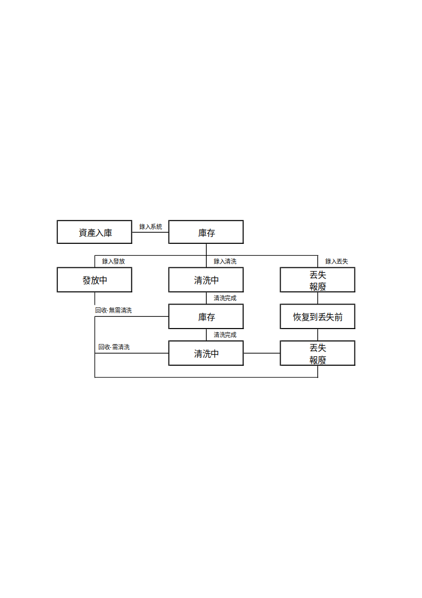

* **業務說明**：
  1. 每半個月針對 PVD 車間靜電衣進行集中統一清洗回收與發放。
  2. 功能模組分為：首頁，報警中心，人員管理，資產管理，發放，回收，清洗，報廢，丟失，帳號設置。（庫存管理、報表中心已移除，不開發）

---

### M02. 登錄與鑑權模組
* **原需求界面示意圖**：


* **功能規格**：
  * **AUTH-01 登錄介面**：輸入工號與密碼，點擊登錄。
  * **AUTH-02 權限過濾**：根據登錄帳號的角色權限，動態顯示/隱藏左側功能選單。
  * **AUTH-03 路由守衛**：非管理員直接輸入 `/settings` 等敏感路徑時，自動攔截並彈出提示。

---

### M03. 首頁概覽 (Dashboard)
* **原需求界面示意圖**：

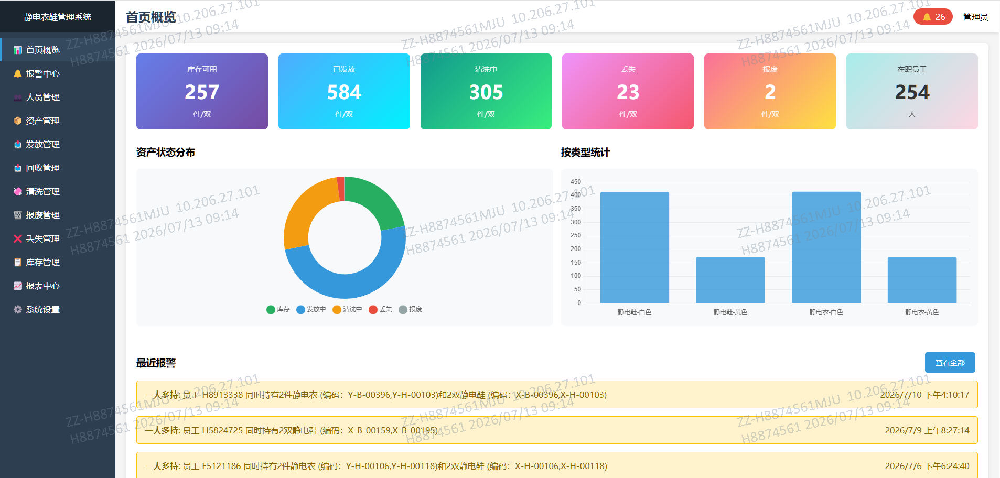

* **現代化 UI 參考 mockup**：

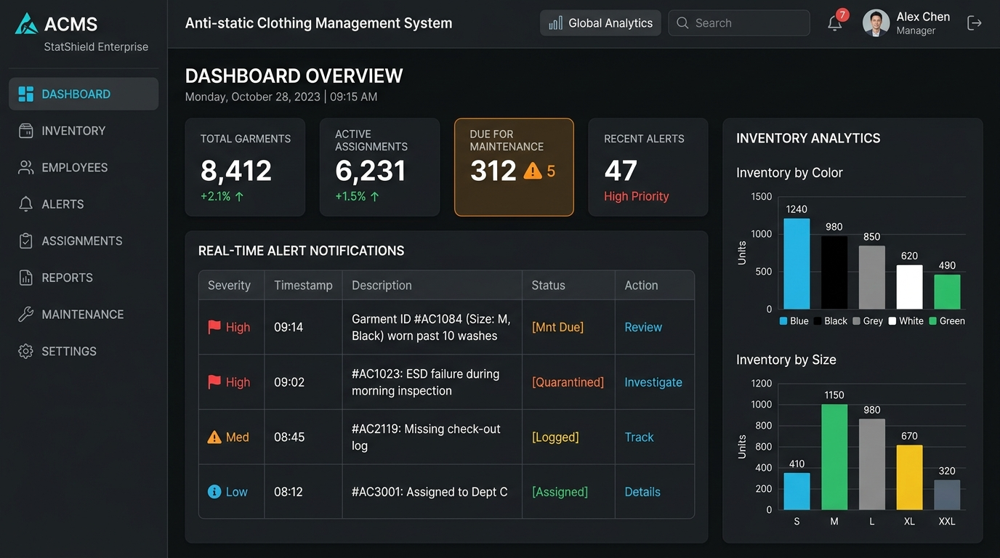

* **功能規格**：
  * **數據卡片**：庫存總數、發放中總數、待送洗總數、清洗中總數、報警預警總數。
  * **圖表聯動**：資產狀態分佈（柱狀圖）與按類型統計（柱狀圖）可聯動——點擊一圖的某分類，另一圖同步過濾。
  * **無最近報警**：首頁概覽不再展示「最近報警」列表（補充需求 #1）。

---

### M04. 報警中心 (Alert Center)
* **原需求界面示意圖**：

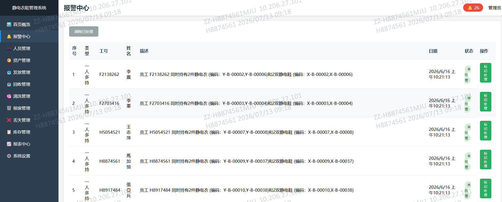

* **功能規格**：
  * **ALT-01 自動觸發檢測**：在【發放】、【回收】、【送洗】、【完成清洗】、【報廢】、【丟失】後，後台自動執行檢測。
  * **ALT-02 一人多持判定**：若某員工持有的 `發放中` 靜電衣 >1 件或靜電鞋 >1 雙，自動寫入預警記錄。
  * **ALT-03 自動消警**：員工歸還多餘物品使持有數 <= 1 後，自動從報警中心消除。
  * **ALT-04 只呈現信息**：報警中心**無**「未處理/已處理」狀態欄位與「標記處理」操作，僅展示報警信息。
  * **ALT-05 手動刷新**：提供刷新按鈕，點擊後從資料庫重新獲取數據；不做定時刷新（補充需求 #2）。

---

### M05. 人員管理 (Personnel)
* **原需求界面示意圖**：

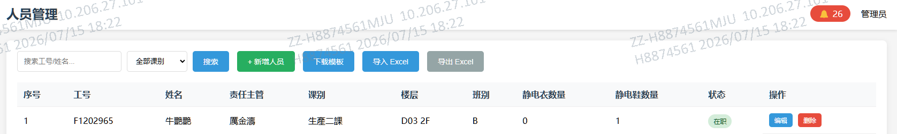

* **原需求新增/編輯彈窗示意圖**：

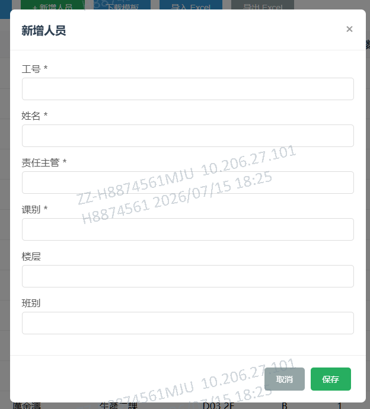

* **功能規格**：
  * **P-01 新增**：工號(唯一必填)、姓名、責任主管、課別、樓層、班別，預設`在職`。
  * **P-02 編輯**：工號不可修改，支援批量編輯與在職/離職切換。
  * **P-03 刪除/離職限制**：若員工有未歸還物品 (`發放中`/`待送洗`/`清洗中`)，強制阻止離職或刪除。
  * **P-04 列表展示**：工號、姓名、責任主管、課別、樓層、班別、狀態；**不顯示靜電衣/靜電鞋數量**（補充需求 #10）。

---

### M06. 資產管理 (Assets)
* **原需求界面示意圖**：

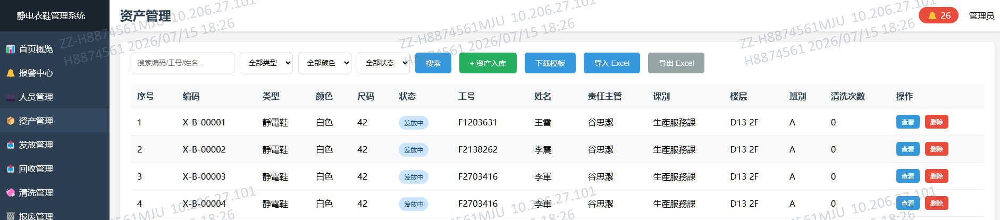

* **原需求入庫彈窗示意圖**：

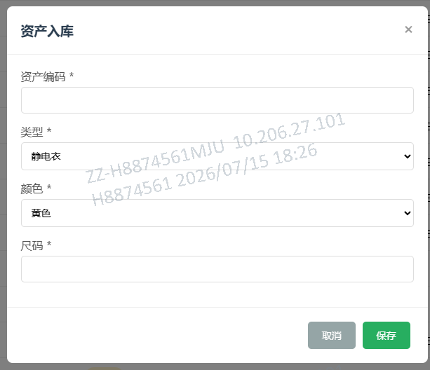

* **原需求資產詳情彈窗示意圖**：

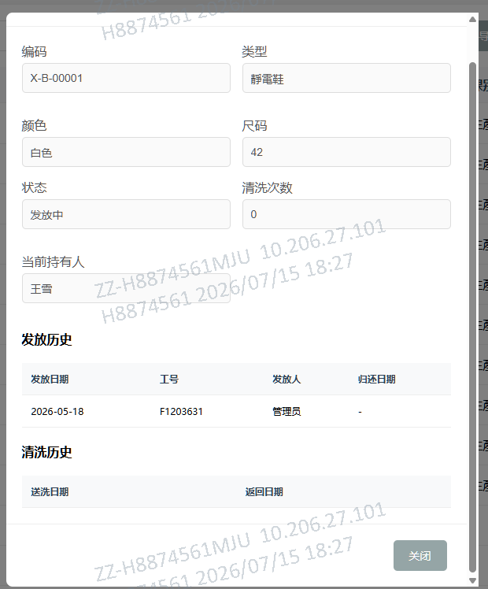

* **功能規格**：
  * **A-01 入庫**：編碼(唯一必填)、類型(`靜電衣`/`靜電鞋`)、顏色(`黃色`/`白色`)、尺碼。初始狀態=`庫存`，清洗次數=`0`，工號/姓名/責任主管/課別/樓層為空；發放後才從人員庫補入記錄（補充需求 #3）。
  * **A-02 資產編碼唯一**：每個資產編碼只有一條記錄；若多次發放，資產列表中只顯示最新發放數據（補充需求 #4）。
  * **A-03 詳情彈窗**：顯示基本資訊 + 發放歷史 + 清洗歷史，且發放歷史與清洗歷史**只顯示最近一次**（補充需求 #4）。
  * **A-04 刪除限制**：狀態為 `發放中`、`待送洗` 或 `清洗中` 時禁止刪除。

---

### M07. 發放管理 (Issue)
* **原需求界面示意圖**：

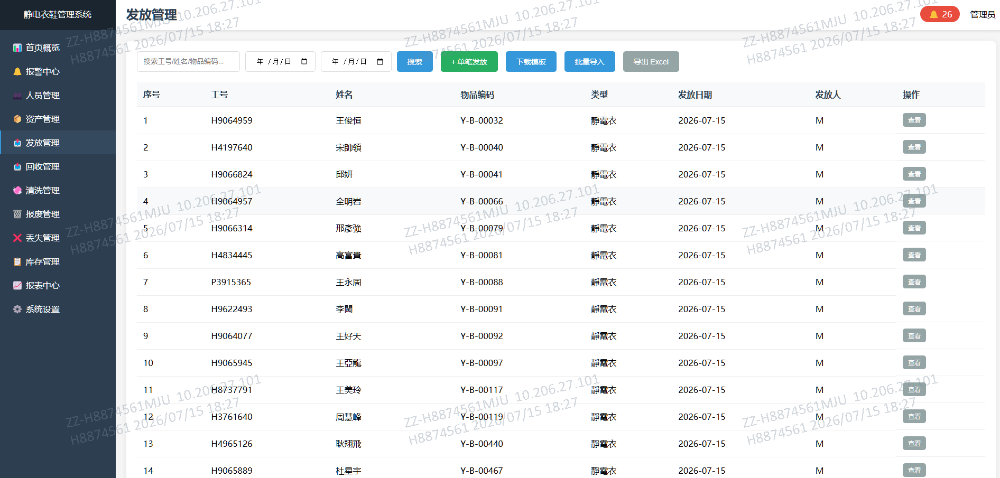

* **原需求發放彈窗示意圖**：

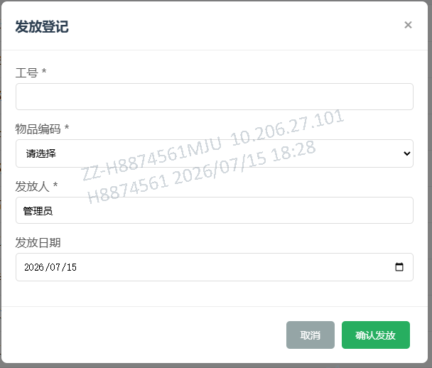

* **功能規格**：
  * **I-01/02 彈窗與校驗**：工號(僅顯示在職)、物品編碼(僅顯示庫存)、發放人、發放日期。
  * **I-03 狀態變更**：`assets.status = 發放中`, `assets.employeeId = 工號`，寫入 `issue_records`；並從人員庫補入工號/姓名/責任主管/課別/樓層快照（補充需求 #3）。
  * **I-04 報警檢測**：發放後自動執行 `AlertManager.checkMultiHold()`。
  * **I-05 全量顯示**：一個資產可能存在多次發放，發放管理頁面**所有記錄都要顯示**（補充需求 #5）。

---

### M08. 回收管理 (Return)
* **原需求界面示意圖**：

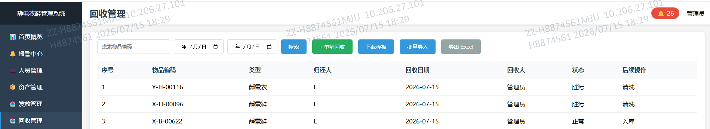

* **原需求回收彈窗示意圖**：

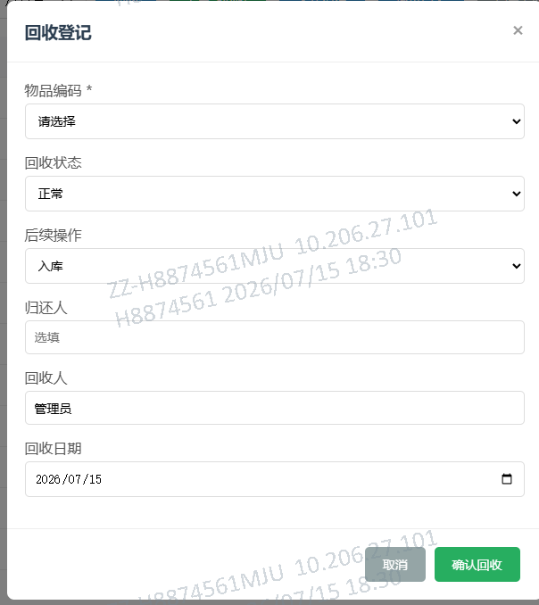

* **功能規格**：
  * **R-01 彈窗欄位**：物品編碼(僅發放中/待送洗/清洗中)、後續操作(`入庫`/`送洗`)、歸還人、回收人、日期。**去掉「回收狀態」欄位**（補充需求 #12）。
  * **R-03 狀態變更**：
    * 選 `入庫` -> `status = 庫存`, 清除 `employeeId`。
    * 選 `送洗` -> `status = 待送洗`。
  * **R-04 發放結算**：自動標記對應 `issue_records.returned = true`。

---

### M09. 清洗管理 (Laundry)
* **原需求界面示意圖**：

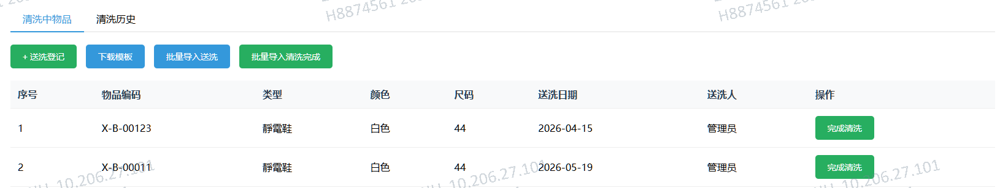

* **原需求送洗彈窗示意圖**：

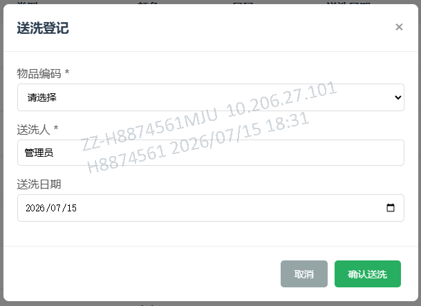

* **功能規格**：
  * **CL-01 單頁籤**：只顯示「清洗中物品」列表，**去掉「清洗歷史」頁籤**。
  * **CL-04 送洗登記**：將 `待送洗` 資產送入清洗，`status = 清洗中`，需上記錄 `oldStatus` 與 `previousEmployeeId`。
  * **CL-05 完成清洗**：點擊確認後 `status = 庫存`，`cleanCount += 1`，完成後**不再在清洗頁面顯示**（補充需求 #11）。

---

### M10. 報廢管理 (Scrap)
* **原需求界面示意圖**：

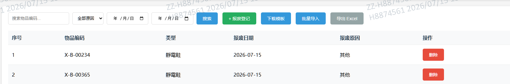

* **原需求報廢彈窗示意圖**：

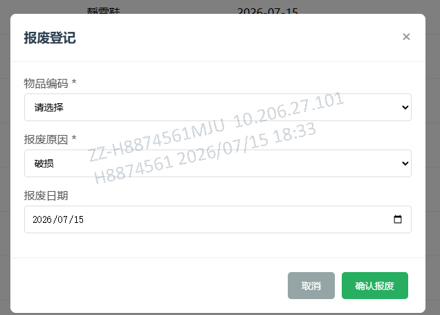

* **功能規格**：
  * **SC-01/02 報廢登記**：物品編碼(非報廢資產)、報廢原因(`破損`/`老化`/`其他`)、日期。暫存前置狀態/持有人/次數 -> `status = 報廢`。
  * **SC-04 撤銷報廢 (回滾核心)**：刪除記錄時，精確恢復資產至報廢前的原始狀態、持有人與清洗次數。

---

### M11. 丟失管理 (Lost)
* **原需求界面與彈窗ASCII示意圖**：

```text
┌──────────────────────────────────────────────────────────┐
│ 丢失管理                                                   │
│ [搜索:___] [开始:___] [结束:___] [搜索] [+丢失登记] [模板] [导入] [导出]│
├────┬────────┬────┬──────┬────────┬──────┬────┤
│序号│物品编码│类型│责任人│发现日期│处理方式│操作│
│ 1  │J-Y-015 │静电衣│E010  │07-11   │补发   │[删除]│
│ 2  │J-X-012 │静电鞋│ -    │07-10   │其他   │[删除]│
└────┴────────┴────┴──────┴────────┴──────┴────┘

【丢失弹窗示意】
┌────────────────────────────┐
│ 丢失登记                    │
│                            │
│ 物品编码 *: [__________v]  │ ← 下拉显示所有非丟失资产（支持粘貼手動輸入）
│ 责任人工号: [__________v]  │ ← 下拉在职员工,选填
│ 处理方式:   [补发 v]       │ ← 补发/其他
│ 发现日期:   [2026-07-11__] │
│                            │
│     [取消]    [确认登记]    │
└────────────────────────────┘
```

* **功能規格**：
  * **LO-01/02 登記**：物品編碼(非丟失資產)、責任人工號(選填在職)、處理方式(`補發`/`其他`)、日期。
  * **LO-04 撤銷丟失 (回滾核心)**：刪除丟失記錄，精確恢復資產至丟失前狀態與持有人。

---

### ~~M12. 庫存管理 (Inventory)~~ — 已移除
* **狀態**：依補充需求 #9，**不再開發**，從功能範圍移除。庫存查詢由「資產管理」的狀態篩選（庫存/發放中/待送洗/清洗中/丟失/報廢）承擔。

---

### ~~M13. 報表中心 (Reports)~~ — 已移除
* **狀態**：依補充需求 #9，**不再開發**，從功能範圍移除。導出需求由各功能模組（首頁/報警/人員/資產）內建的 Excel 導出按鈕承擔。

---

### M12. 帳號設置 (Account Settings)
* **功能規格**：
  * **AS-01 帳號設置**：系統設置改為「帳號設置」，**採用 `platform-system-server-master` 的統一後台**管理帳號、角色、菜單與權限（補充需求 #9）。
  * **AS-02 不在本服務開發**：ESD 業務服務不實現帳號/密碼/角色/菜單管理，僅消費平台登入身份與權限碼。

---

## 五、 資料庫 Schema 實體關係規範 (Database Blueprint)

```sql
-- 1. 人員表 (personnel)
CREATE TABLE personnel (
    employee_id VARCHAR(50) PRIMARY KEY, -- 工號(唯一)
    name VARCHAR(100) NOT NULL,           -- 姓名
    supervisor VARCHAR(100) NOT NULL,     -- 責任主管
    department VARCHAR(100) NOT NULL,     -- 課別
    floor VARCHAR(50),                    -- 樓層
    shift VARCHAR(50),                    -- 班別
    status VARCHAR(20) DEFAULT '在職',    -- 在職 / 離職
    created_at TIMESTAMP DEFAULT CURRENT_TIMESTAMP
);

-- 2. 資產主檔表 (assets)
CREATE TABLE assets (
    asset_code VARCHAR(50) PRIMARY KEY,   -- 物品編碼(唯一，每個編碼僅一條記錄)
    type VARCHAR(20) NOT NULL,            -- 静电衣 / 静电鞋
    color VARCHAR(20) NOT NULL,           -- 黄色 / 白色
    size VARCHAR(20) NOT NULL,            -- S/M/L/XL/36-44
    status VARCHAR(20) NOT NULL,          -- 库存 / 发放中 / 待送洗 / 清洗中 / 报废 / 丢失
    employee_id VARCHAR(50) REFERENCES personnel(employee_id), -- 當前持有人(發放後補入)
    clean_count INT DEFAULT 0,            -- 累計清洗次數
    created_at TIMESTAMP DEFAULT CURRENT_TIMESTAMP
);

-- 3. 發放記錄表 (issue_records)
CREATE TABLE issue_records (
    id VARCHAR(50) PRIMARY KEY,
    employee_id VARCHAR(50) NOT NULL REFERENCES personnel(employee_id),
    asset_code VARCHAR(50) NOT NULL REFERENCES assets(asset_code),
    employee_no VARCHAR(50) NOT NULL,     -- 工號快照
    employee_name VARCHAR(100) NOT NULL,  -- 姓名快照
    supervisor VARCHAR(100) NOT NULL,     -- 責任主管快照(發放時從人員庫補入)
    department VARCHAR(100) NOT NULL,     -- 課別快照(發放時從人員庫補入)
    floor VARCHAR(50),                    -- 樓層快照
    issuer VARCHAR(100) NOT NULL,         -- 發放人
    issue_date DATE NOT NULL,
    returned BOOLEAN DEFAULT FALSE,       -- 是否已歸還/回收/送洗結算
    return_date DATE
);

-- 4. 回收記錄表 (return_records) — 去掉「回收狀態」
CREATE TABLE return_records (
    id VARCHAR(50) PRIMARY KEY,
    asset_code VARCHAR(50) NOT NULL REFERENCES assets(asset_code),
    next_action VARCHAR(20) NOT NULL,     -- 入库 / 送洗
    returner VARCHAR(100),                -- 歸還人
    receiver VARCHAR(100) NOT NULL,       -- 回收人
    return_date DATE NOT NULL
);

-- 5. 清洗記錄表 (laundry_records)
CREATE TABLE laundry_records (
    id VARCHAR(50) PRIMARY KEY,
    asset_code VARCHAR(50) NOT NULL REFERENCES assets(asset_code),
    sender VARCHAR(100) NOT NULL,
    send_date DATE NOT NULL,
    return_date DATE,                     -- 返回日期(null表示清洗中)
    completed BOOLEAN DEFAULT FALSE,
    previous_status VARCHAR(20),          -- 送洗前狀態
    previous_employee_id VARCHAR(50)     -- 送洗前持有人
);

-- 6. 報廢記錄表 (scrap_records)
CREATE TABLE scrap_records (
    id VARCHAR(50) PRIMARY KEY,
    asset_code VARCHAR(50) NOT NULL REFERENCES assets(asset_code),
    reason VARCHAR(50) NOT NULL,          -- 破损 / 老化 / 其他
    scrap_date DATE NOT NULL,
    previous_status VARCHAR(20),          -- 報廢前狀態(用於撤銷)
    previous_employee_id VARCHAR(50),     -- 報廢前持有人
    previous_clean_count INT              -- 報廢前清洗次數
);

-- 7. 丟失記錄表 (lost_records)
CREATE TABLE lost_records (
    id VARCHAR(50) PRIMARY KEY,
    asset_code VARCHAR(50) NOT NULL REFERENCES assets(asset_code),
    responsible_employee_id VARCHAR(50),  -- 責任人工號
    handle_method VARCHAR(20) NOT NULL,   -- 补退 / 其他
    discover_date DATE NOT NULL,
    previous_status VARCHAR(20),          -- 丟失前狀態(用於撤銷)
    previous_employee_id VARCHAR(50),
    previous_clean_count INT
);

-- 8. 預警記錄表 (alert_records) — 報警中心只呈現信息，無處理狀態
CREATE TABLE alert_records (
    id VARCHAR(50) PRIMARY KEY,
    type VARCHAR(50) NOT NULL,            -- 一人多持
    employee_id VARCHAR(50) NOT NULL,
    description TEXT NOT NULL,            -- 報警描述(包含超量編碼)
    alert_date DATE NOT NULL
);

-- 9. 操作日誌表 (audit_logs)
CREATE TABLE audit_logs (
    id VARCHAR(50) PRIMARY KEY,
    timestamp TIMESTAMP DEFAULT CURRENT_TIMESTAMP,
    operator VARCHAR(100) NOT NULL,
    action_type VARCHAR(20) NOT NULL,     -- create / update / delete
    module VARCHAR(50) NOT NULL,
    details TEXT NOT NULL
);

-- 註：不建立本地 users 表。帳號、密碼、角色、菜單由 platform-system-server-master 統一管理。
```

---

## 六、 GPT-5.6 專用開發指引與 Prompt

當您將本需求文檔提交給 **GPT-5.6 / SOL** 進行代碼開發時，請複製並使用以下 Prompt：

```text
【開發指令】：
你現在是 Senior Full-Stack Developer。請根據附件中的《靜電衣鞋管理系統_詳細需求規格說明書.md》，使用 React/Vue 3 + Node.js/Python (或 Single-File SPA 獨立端) 構建完整的靜電衣鞋管理系統。

 UI 與介面主要參考規範：
請務必嚴格參照需求文檔中「第四章」嵌入的【Excel 原始界面示意圖 (image1~image17)】以及【ASCII 界面與彈窗示意圖】來佈局各頁面 UI 元素、搜尋條件與彈窗輸入欄位。

重點開發規範：
1. 嚴格貫徹 6 大資產狀態 (庫存、發放中、待送洗、清洗中、報廢、丟失) 的狀態機流轉邏輯。
2. 實現【報廢撤銷】與【丟失撤銷】時的前置狀態、持有人與清洗次數的回滾 (Rollback) 機制。
3. 實作 AlertManager.checkMultiHold() 演算法：每次發放、回收、送洗、報廢、丟失後自動檢測「一人多持」(同員工靜電衣>1或靜電鞋>1)，自動生成或清除報警記錄。
4. 各功能模組（首頁/報警/人員/資產）提供 Excel 導入/導出（批量導入一行失敗即整體回滾）。
5. 帳號、角色、菜單與權限由 platform-system-server-master 統一後台管理，本服務不實現。
```
